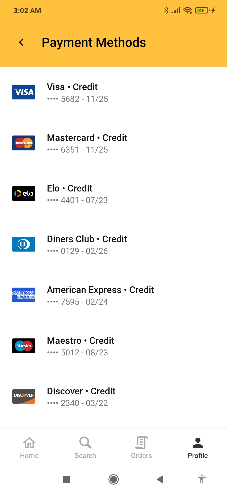

<div align="center">

[](https://www.npmjs.com/package/react-native-payment-icons)
[](http://www.typescriptlang.org/)
[](http://makeapullrequest.com)
[](#)
<!-- wait until stats available [](https://www.npmjs.com/package/react-native-payment-icons) -->

</div>

# react-native-payment-icons

There wasn't a package for displaying credit cards and other payment icons in React Native. **Wasn't!**

We use SVGs that were transormed into React Native JSX, so there isn't a loading time to show them up.

The SVGs are compressed / optimized by ~60%. It uses the Flat Rounded images from [`aaronfagan/svg-credit-card-payment-icons`](https://github.com/aaronfagan/svg-credit-card-payment-icons), and I intend to support other icon packs in the future, in a tree-shakable way.

If you need to discover the card type (`visa`, `mastercard` etc), you can use the [credit-card-type](https://www.npmjs.com/package/credit-card-type) package.



> My App using this package!

## 💿 Installation

1) Install [react-native-svg](https://github.com/react-native-svg/react-native-svg)

2) Install this package:
```bash
npm install react-native-payment-icons
# or
yarn add react-native-payment-icons
```

## 📖 Usage

```tsx
import {PaymentIcon} from 'react-native-payment-icons'

<PaymentIcon type='visa'/>
<PaymentIcon type='master' width={50}/>
<PaymentIcon type='paypal' height='30%'/>
```

* You must set the `type` property to the desired payment method / credit card. Available `types`:

```
alipay
american-express
amex             // Alias to american-express
code             // Card's CVV representation
diners-club
diners           // Alias to diners-club
discover
elo
generic
hiper
hipercard
jcb
maestro
mastercard
master           // Alias to mastercard
mir
paypal
unionpay
visa
```

> Their images are available at [`aaronfagan/svg-credit-card-payment-icons`](https://github.com/aaronfagan/svg-credit-card-payment-icons)

* You shall define either `width` or `height`. No need to define both, as it's set `aspectRatio: 780 / 500`, the width / height of the SVGs. If neither is defined, `width` defaults to `40`.

* It also accepts all the props of the `Svg` component.

## 📰 [Changelog](CHANGELOG.md)


## 🤖 Dev

> How to setup your own images! If you just want to use the package, you may ignore this!

* To transform the SVGs, [download the .svgs](https://stackoverflow.com/a/18194523/10247962) from [svg-credit-card-payment-icons](https://github.com/aaronfagan/svg-credit-card-payment-icons). I used the flat-rounded styled images. Store them in `./svgsSrc/`, a new dir.

* If you want to add your own images, be sure that their width are 780 and height 500, to have the same ratio as the others.

#### You may run `npm run svg` that executes the two steps below!

* Run [svgo](https://github.com/svg/svgo) to compress the SVGs. The best here is `-p 0` which sets the precision to 0, decreasing the total size from 96KB to 38KB. The quality loss isn't noticeable unless comparing, except in mastercard and diners that have some artifacts, so we set `precision 1` for them. There are other **svgo** plugins set in `svgo.config.js` file that are automatically applied when running **svgo** at the same **cwd**.

`npx svgo -f ./svgsSrc -o ./svgsCompressed -p 0`

`npx svgo -p 1 ./svgsSrc/mastercard.svg ./svgsSrc/diners.svg -o ./svgsCompressed/mastercard.svg ./svgsCompressed/diners.svg`

* Then, transform them into React Native format using [svgr](https://github.com/gregberge/svgr). `--native` for generating code for React Native, `--typescript` for .tsx. We store them under `src/components`:

`npx @svgr/cli ./svgsCompressed --out-dir src/components --native --typescript`

> There may happen some errors in the RN convertion you may need to deal manually. If happens, `npm run build` will throw them up.

* An `index.tsx` will be automatically created re-exporting all the components.

* If adding or removing images, you will need to change src/index.tsx to add / remove the components in the dictionary.

* If you want to compile the TS files into JS, `npm run build`.

<!-- https://unblast.com/free-payment-method-icons-ai/ -->
<!-- https://unblast.com/20-payment-card-icons-psd/ -->
